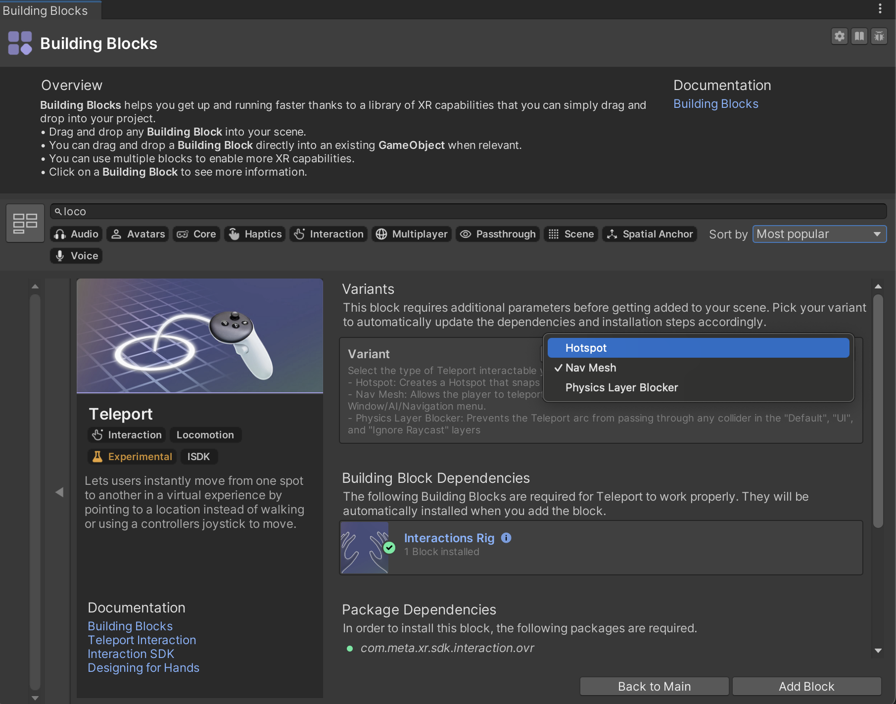

# Unity Design - Week 11

## Agenda

1. [Locomotion Categories](#locomotion-categories)
2. [Physical Locomotion](#physical-locomotion)
3. [Artificial Locomotion](#artificial-locomotion)
4. [Comfort Considerations](#comfort-considerations)
5. [Meta SDK Teleport Building Block](#teleport-building-block)
6. [Transfering Assets within Unity Scenes](#transfering-assets)

---

## Locomotion Categories

Locomotion is a core component of VR interaction design. Because VR movement affects comfort, presence, and gameplay, developers must select methods that match their experience goals while minimizing motion sickness. VR locomotion methods generally fall into two groups:

### **Physical Locomotion**

Movement driven by real-world body motion. Most comfortable but limited by physical play space.

### **Artificial Locomotion**

Movement triggered through controls, gestures, or system simulation. Offers unlimited mobility but can reduce comfort if not designed carefully.

---

## Physical Locomotion

Physical locomotion techniques rely on a user’s actual body movement to move their in-game avatar.

### **1. Room-Scale Movement**

Players walk within their tracked boundary; in-game motion matches real-world motion.

* Extremely comfortable and natural
* Limited by available space
* Works best for small-scale or puzzle-based VR environments

### **2. Physical Redirected Walking (Advanced)**

Subtle visual manipulations steer players in circles to simulate larger spaces.

* Creates the illusion of large environments in a small room
* Requires careful design and can be disorienting if done poorly
* Primarily used in research or specialized installations

---

## Artificial Locomotion

Artificial methods expand movement beyond physical boundaries through simulated or input-driven motion.

---

### Avatar-Based Locomotion

Movement is synchronized from **body gestures** or **simulated avatar actions**.

Examples:

* Arm-swinging movement (moving arms mimics jogging)
* Jumping gestures mapped to in-game jumps
* Hand poses to initiate dashing or directional movement

**Pros:**

* High sense of presence
* Often more comfortable than joystick movement

**Cons:**

* Requires motion-tracking accuracy
* Can be tiring over long sessions

---

### Environmental Locomotion

Movement triggered by **in-world environmental mechanics**.

Examples:

* Climbing ladders, ropes, walls
* Riding platforms, vehicles, elevators
* Moving walkways or environmental triggers

**Pros:**

* Extremely comfortable; movement is anchored to objects
* Encourages intuitive exploration

**Cons:**

* Limited to environments designed for it
* Not ideal for open-world navigation

---

### Steering Locomotion

Users steer movement direction via **joystick, head orientation, hand orientation, or body tilt**.

Common implementations:

* Thumbstick smooth locomotion
* “Head-based” forward movement
* “Hand-based” locomotion (point to move)
* “Torso-based” navigation

**Pros:**

* Full control and continuous navigation
* Enables large worlds

**Cons:**

* Higher risk of motion sickness
* Requires comfort settings (vignette, reduced speed, snap turning)

---

### Pulling / Arm-Swinging Locomotion

Users “pull” themselves through space using hand motions or interactable surfaces.

Forms include:

* **Grapple / Hookshot pulling** (Spider-Man-like movement)
* **Hand-over-hand pulling** on virtual surfaces
* **Swimming locomotion** (players swim to move)
* **Arm-swing locomotion** (swinging hands simulates walking/jogging)

**Pros:**

* Highly immersive and intuitive
* Often more comfortable because movement is self-driven

**Cons:**

* Can be tiring
* Requires precise physics and hand tracking

---

### Teleportation

Players point to a destination and instantly jump to it with optional fade-in/out transitions.

Types:

* **Arc teleportation** (most common)
* **Blink teleportation** (instant jump)
* **Dash teleportation** (quick forward movement)

**Pros:**

* Most comfortable artificial locomotion
* Great for beginners and broad audiences
* Combines well with large environments

**Cons:**

* Can reduce immersion
* Harder to design certain combat or timed interactions
* Not suitable for fast-paced experiences

---

## Comfort Considerations

To ensure user comfort, consider incorporating:

* Snap turning (instead of smooth turning)
* Reduced acceleration and rotation speeds
* Vignettes during movement
* Clear visual anchors (UI, horizon markers)
* User-selectable locomotion presets
* Hybrid systems combining teleport + continuous movement

---

## VR Locomotion using Meta SDK Teleport Building Block

The **Teleport Building Block** in the Meta XR Unity SDK provides a ready-made locomotion solution for VR applications. It supports multiple movement logic types and is fully compatible with the **Interaction SDK**, **Hand Tracking**, and **Controller Input**.

Meta provides three main teleportation workflows:

| Variant                      | Purpose                                                   |
| ---------------------------- | --------------------------------------------------------- |
| **NavMesh Teleport**         | Teleport based on Unity NavMesh walkable surfaces         |
| **Hotspot Teleport**         | Teleport to pre-defined markers or “stations”             |
| **Physics Blocker Teleport** | Prevent teleporting into restricted areas using colliders |


---

## Importing the Teleport Building Block

1. Open Unity’s **Project** window.
2. Navigate to:
   **Assets → Meta → XR → BuildingBlocks**
3. Open:
   **Teleportation** or **Locomotion** category
4. Choose **Teleport** or **Teleport (Hand/Controller)** prefabs.
5. Drag the prefab into your scene under your **XR Origin**.

This adds:

* Teleport Interactor
* Arc Visual
* Locomotion Manager
* Required input actions (hand or controller)

---

## Teleport Variants

---

## 1. NavMesh Teleport

This variant uses Unity’s built-in **NavMesh** system. Users may only teleport onto surfaces marked as “walkable.”

### **Setup Steps**

#### **A. Prepare the NavMesh**

1. Select the floors or ground meshes in your scene.
2. In the **Inspector**, enable:
   **Navigation → Object → Navigation Static**
3. Set them to **Walkable**.
4. Open **Window → AI → Navigation** and bake the NavMesh.

#### **B. Assign NavMesh to Teleport Provider**

1. Select your **TeleportInteractor** or Teleport Provider object (part of the Building Block).
2. Find the **Teleport Target Handler NavMesh** component.
3. Ensure the baked NavMesh is active in the scene.

#### **C. Test**

* Enter Play Mode
* Point to areas on the baked NavMesh
* You should see valid teleport arcs only on allowed surfaces

---

## 2. Hotspot Teleport

Hotspot teleportation lets you define **specific teleport destinations**, rather than free movement. Useful for guided VR tours, puzzle rooms, and controlled experiences.

### **Setup Steps**

#### **A. Add Hotspot Markers**

1. Right-click in the hierarchy:
   **Create → Meta XR → Teleport Hotspot**
2. Position the hotspot in your scene.
3. Adjust visual indicators (icons, pads) as needed.

#### **B. Attach Hotspot Target Handler**

1. On your TeleportInteractor object, add:
   **Teleport Target Handler Hotspot**
2. Assign your hotspot(s) to the list.

#### **C. Test**

* Enter Play Mode
* Point at hotspots
* Valid teleport arcs should appear only when selecting a hotspot

---

## 3. Physics Blocker Teleport

This variant uses colliders to block teleportation into restricted areas. Instead of specifying where someone *can* teleport, you specify where they *cannot*.

### **Setup Steps**

#### **A. Add Blockers**

1. Create or select any object you want to use as a teleportation barrier.
2. Add a **Collider** (Box, Sphere, Capsule).
3. Mark it as:
   **Teleport Blocker** layer (or custom layer used by your building block).
4. Ensure collider **is NOT** a trigger.

#### **B. Configure Teleport Provider**

1. Select Teleport Provider or Teleport Interactor.
2. Add or confirm the component:
   **Teleport Target Handler Physics Raycaster**
3. Assign which layers are considered “blocked.”

#### **C. Test**

* Attempt to teleport through a wall or into blocked regions
* The arc should turn invalid and landing will be denied

---

Below is a polished, well-structured **GitHub README** outlining the different ways to move hierarchy objects **from Unity Scene to Scene** and **from one Unity Project to another**. It is formatted for technical clarity and practical workflows.

---

## Unity Object Transfer Guide

Unity allows many workflows to move GameObjects between scenes and between projects. However, the best method depends on whether you also need to preserve:

* Prefab links
* Scripts and script references
* Materials, textures, and models
* Physics and animation data
* Package dependencies

---

## Transferring Objects Between Scenes

---

### 1. Copy & Paste (Standard Workflow)

**Use when:** You need a quick, simple transfer and prefab relationships don’t matter.

**Steps:**

1. Select the object(s) in the Hierarchy.
2. Press **Ctrl+C / Cmd+C**.
3. Open the target scene.
4. Press **Ctrl+V / Cmd+V**.

**Pros:**

* Fast and simple
* Works for most GameObjects
* Preserves components and values

**Cons:**

* Does **not** preserve prefab links if the prefab doesn't exist in the target scene
* Risk of missing referenced assets (materials, scripts)

---

### 2. Prefabs (Recommended)

Prefabs allow the cleanest and safest transfer method inside the same project.

**Steps:**

1. Drag the object from the Hierarchy to the **Project window** to create a prefab.
2. Open the new scene.
3. Drag the prefab in.

**Pros:**

* Keeps everything modular
* Maintains prefab structure
* Allows reusability and versioning

**Cons:**

* Requires prefab creation
* Nested structures may need unpacking or overrides

---

### 3. Nested Prefabs

For objects composed of multiple sub-objects:

**Steps:**

* Convert the root object into a prefab
* All children remain intact

**Pros:**

* Great for complex hierarchies
* Easy to update across scenes

---

### 4. Multi-Scene Editing

Unity allows having multiple scenes open at the same time.

**Steps:**

1. **File → Open Scene Additive**.
2. Select the object in Scene A.
3. Drag it directly into Scene B in the Hierarchy.

**Pros:**

* Drag-and-drop between open scenes
* Ideal for large environments or modular levels

**Cons:**

* Scenes must be cleanly structured
* Multi-scene management can get complicated

---

## Transferring Objects Between Projects

---

### 1. UnityPackage Export / Import

**The most reliable and recommended method.**

**Steps to Export:**

1. Select objects or folders in the Project window.
2. Right-click → **Export Package…**
3. Make sure all dependencies are checked.
4. Save the `.unitypackage` file.

**Steps to Import:**

* In the target project: **Assets → Import Package → Custom Package…**

**Pros:**

* Preserves references
* Includes textures, prefabs, scripts, and materials
* Widely supported

**Cons:**

* Package size can be large
* Not ideal for version control automation

---

### 2. Prefab Export

If you only need the hierarchy object structure:

**Steps:**

1. Convert object to a prefab.
2. Export the prefab + its materials/models manually or via UnityPackage.

**Pros:**

* Keeps object structure intact
* Easy to reuse

**Cons:**

* Must ensure dependencies are included

---

### 3. Copying Asset Folders Manually

**Use only for advanced users.**

**Steps:**

1. Copy the relevant folders from the `Assets` directory in Project A.
2. Paste into the `Assets` folder of Project B.
3. Let Unity reimport assets.

**Pros:**

* Fast
* Good for bulk asset migration

**Cons:**

* Easy to miss dependencies
* May break script references
* No dependency warnings

---

### 4. Version Control (Git, Plastic SCM)

Works if projects share a repo or you merge selective branches.

**Workflow Example:**

* Create a branch with the desired assets (prefabs/scenes).
* Merge or cherry-pick into the new project repo.

**Pros:**

* Full history and diffs
* Automated conflict resolution

**Cons:**

* Requires repo setup
* Scenes are not human-diffable

---

### 5. Unity Asset Store / Custom Packages (UPM)

For large reusable systems, turn objects into a **Unity Package Manager** package.

**Pros:**

* Best for modular, reusable systems
* Versioning built-in
* Clean dependency management

**Cons:**

* Requires structure and manifest editing
* Not ideal for small transfers

---

## Transferring Scenes Themselves

You can also move an entire **Scene file** between projects.

**Steps:**

1. Copy the `.unity` scene file + its folder dependencies.
2. Paste into the target project.
3. Ensure all referenced materials, textures, prefabs, and scripts are included.

**Note:**
A scene alone will break if any referenced assets are missing.

---

## Handling Missing References

If you encounter broken references:

* Reassign missing **Prefabs**
* Replace missing **Materials**
* Fix missing **Scripts** (ensure identical namespaces and class names)
* Check asset GUID conflicts in `.meta` files
* Ensure both projects use compatible **Unity versions**

---

## Best Practices

### ✔ Always Use Prefabs

Objects that may be reused → turn into prefabs immediately.

### ✔ Export via UnityPackage for cross-project moves

Unity handles dependencies automatically.

### ✔ Keep Assets Organized

Use folders like:

```
Assets/
 ├── Art/
 ├── Prefabs/
 ├── Scenes/
 ├── Scripts/
 └── Materials/
```

### ✔ Avoid dragging objects directly from the hierarchy into another project

This causes missing scripts, materials, and textures.

### ✔ Use Version Control for large systems

Especially if sharing across multiple projects or teams.

---

# Visual Quality Guide for Unity VR Projects

**Improving Graphics Through Settings, Lighting, Materials, and Optimization**

VR visuals must be sharp, readable, and comfortable. This requires balancing **rendering budget**, **lighting accuracy**, and **material complexity**, while ensuring smooth framerates on standalone headsets.

This guide outlines practical, production-proven steps that significantly elevate visual fidelity without exceeding performance constraints.

---

## Project Settings for Better VR Visuals

### **1. URP (Universal Render Pipeline)**

URP is strongly recommended for VR due to its performance and flexibility.

**Enable URP Settings:**

* Use **Forward Rendering** (default)
* Enable **Opaque Texture** if needed for post-processing
* Use **Foveated Rendering** on supported devices
* Set **Stable Fit Projection** to reduce edge distortion

### **2. Anti-Aliasing (AA)**

VR headsets show aliasing easily.

Recommended settings:

* Use **4x MSAA** for standalone VR
* Enable **Temporal Anti-Aliasing (TAA)** only for PCVR (but test for ghosting)
* Avoid post-process FXAA in VR

### **3. Resolution & Foveated Rendering**

Use platform-specific settings:

**Meta Quest (Mobile VR):**

* Enable **Fixed Foveated Rendering (FFR)**
* Test levels from **Off → High** depending on GPU load
* Optionally increase **Eye Buffer Resolution**

**PCVR:**

* Use **SteamVR / Oculus supersampling**

---

## Lighting Techniques for VR

### **1. Prefer Baked Lighting (Static Environments)**

Baked lighting offers the best quality/performance ratio.

* Use the **Progressive GPU Lightmapper**
* Bake **Global Illumination (GI)**
* Use **Light Probes** for dynamic objects
* Avoid real-time shadows where possible

### **2. Mixed Lighting for Hybrid Scenes**

If some lights need movement or flicker:

Use **Mixed Mode → Shadowmask**

* Static objects receive baked shadows
* Dynamic objects receive real-time shadows on small areas

### **3. Real-Time Lighting (Use Sparingly)**

For dynamic VR environments:

* Limit to 1–2 real-time lights
* Disable unnecessary shadow casting
* Use **soft shadows** only if targeting PCVR
* Reduce shadow distance & shadow resolution

### **4. Reflection Probes**

Accurate reflections increase realism.

* Place reflection probes in interior rooms
* Set them to **Baked** or **Custom**
* For Quest, limit probe updates (never update in real-time)

### **5. Skyboxes**

Use optimized skyboxes:

* Mobile VR → low-res compressed skybox
* PCVR → HDRI skyboxes allowed

---

## Materials & Shaders

### **1. Use URP Lit or Simple Lit Shader**

In VR, shader cost matters.

**Recommended:**

* **URP Simple Lit** for mobile VR
* **URP Lit** for PCVR environments
* Disable features you don’t use (specular, normal maps, etc.)

### **2. Normal Maps & Roughness Maps**

These help objects read better in VR.

* Use compressed normal maps for Quest
* Use roughness maps to avoid flat/smooth surfaces
* Avoid parallax or tessellation in mobile VR

### **3. Texture Resolution Guidelines**

Optimized textures improve clarity without draining memory.

**Mobile VR:**

* 512–1024 px for props
* 1024–2048 px for hero assets
* Prefer ASTC compression

**PCVR:**

* 2048–4096 px for hero assets
* BC7 / HDR textures allowed

### **4. Material Instancing**

Reduce draw calls:

* Enable GPU Instancing
* Use shared materials
* Avoid material overrides unless necessary

---

## Level Design for High Visual Clarity

### **1. Maintain Proper Scale**

VR realism depends heavily on believable dimensions.

* 1 unit = 1 meter
* Door height ≈ 2 meters
* Table height ≈ 0.75 meters

### **2. Avoid Clutter**

Too much object density hurts performance and readability.

### **3. Keep a Strong Color & Lighting Style**

VR scenes should emphasize:

* High contrast
* Clean silhouettes
* Simple but readable textures

### **4. Use Fog & Atmospheric Effects** (PCVR only)

Fog can improve depth perception and reduce harsh transitions.
Mobile VR → avoid fog unless baked or extremely cheap.

---

## Performance Considerations

### **1. GPU Optimization**

* Limit real-time lights
* Reduce post-processing
* Use GPU occlusion culling if possible
* Use **LOD Groups** aggressively

### **2. CPU Optimization**

* Reduce physics colliders
* Simplify scripts and updates
* Avoid large numbers of dynamic rigidbodies

### **3. Post-Processing (Use Carefully)**

**For Meta Quest (Mobile VR):**

* Bloom: off / very low
* Depth of field: **never**
* Motion blur: **never**
* Color grading: extremely lightweight

**PCVR:**

* Bloom, vignette, AO allowed
* Use TAA cautiously

---

## Quality Checklist

### **Graphics**

* [ ] URP enabled
* [ ] 4x MSAA
* [ ] Correct lighting setup (baked/mixed)
* [ ] FFR enabled on Quest
* [ ] Reflection probes placed

### **Materials**

* [ ] Using Simple Lit or optimized shaders
* [ ] Textures compressed
* [ ] Normal/roughness maps applied where beneficial
* [ ] GPU instancing enabled

### **Performance**

* [ ] Minimized real-time shadows
* [ ] LODs on all complex meshes
* [ ] Post-processing optimized
* [ ] Frame rate stable at 72 / 90 / 120 fps

---

## Additional Resources

* Light Your World in Unity (1 min tutorial)
* https://m.youtube.com/watch?v=NOv31HSqs6U
* Lighting And Post-Processing Low Poly Scene
* https://m.youtube.com/watch?v=uwYf1yMPuvk
* LIGHT BAKING in Unity (URP Version)
* https://m.youtube.com/watch?v=XjRNWH8Eazo
* Unity INTERIOR Lighting for Noobs - URP
* https://m.youtube.com/watch?v=OLVvQlepNOI&pp=0gcJCR4Bo7VqN5tD
* Level Design in Unity
* https://m.youtube.com/watch?v=SF2H0TxfgqM&pp=ugUEEgJlbg%3D%3D

---


